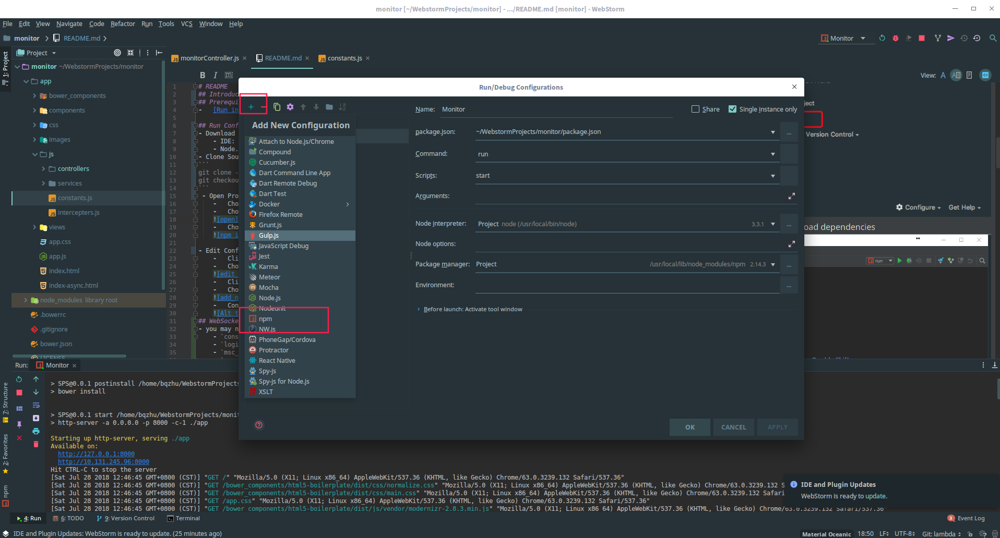
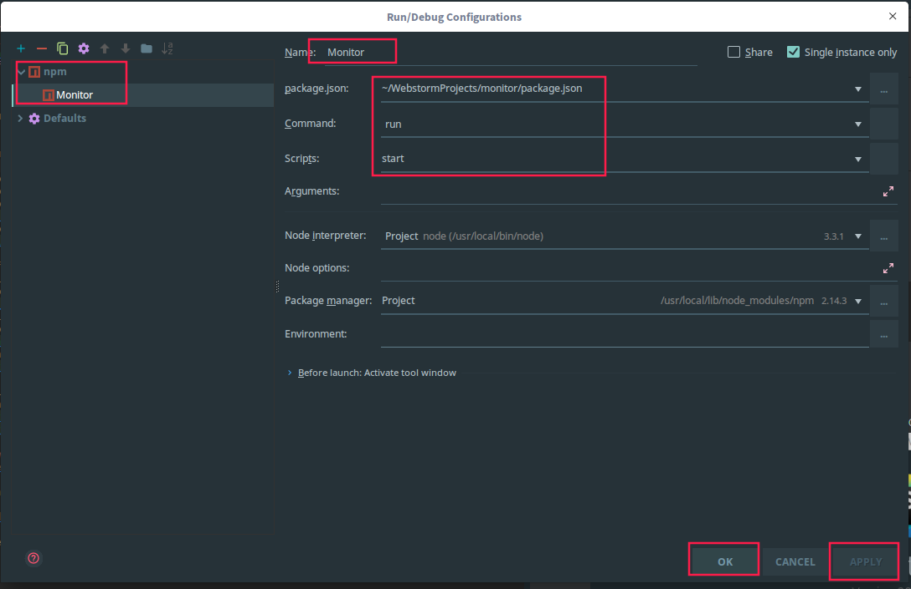
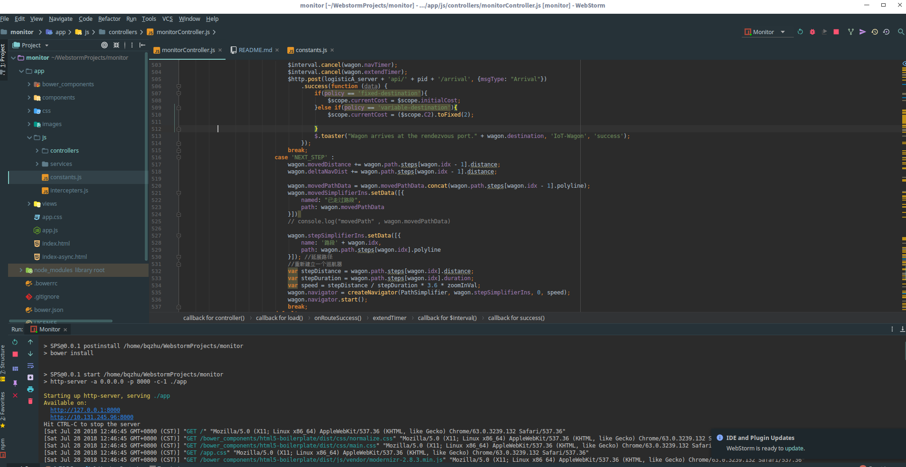
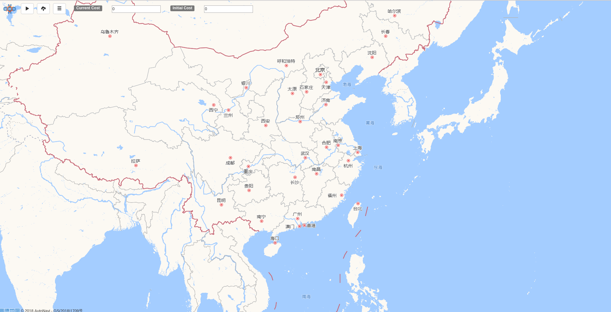

# README
## Introduction
The frontend of L2L system.
## Prerequisites
- Download development tools:
    - IDE: [WebStrom](http://www.jetbrains.com/webstorm/)
    - Node.js 8.9.4LTS [Node.js](https://nodejs.org/en/)
- Clone Source Code:
```
git clone --recursive git@github.com:i-qiqi/L2L.git
git checkout lambda
```
## Run Configuration
 - Open Project in WebStrom:  
    -   Choose `Open Project`
    -   Choose the `directory path` which you clone the source code
    
    -   Choose `run npm install` Wait for npm to download dependencies
    

- Edit Configuration:
    -   Click `Run`
    -   Choose `Edit Configuration`
    
    -   Click the `+` in left-up corner
    -   Choose `npm`
    
    -   Configure npm settings
    
## WebSocket Configuration
- you may need to modify the endpoint for WebSocket connection.
    - `const vesselA_server` :  endpoint for vessel enterprise.
    - `logisticA_server` :  endpoint for logistics enterprise.
    - `msc_server` :  endpoint for Manager Supplier Coordinator.
    - `vmc_server` : endpoint for Vessel Manager Coordinator.
    
##  Run AgularJS Application
- Url :  [http://localhost:8000](http://localhost:8000)
    
    